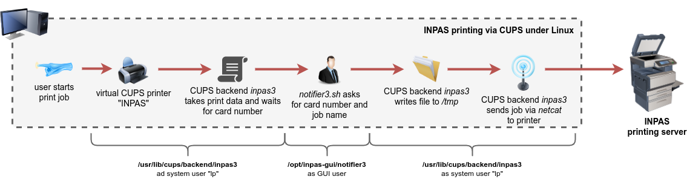

# INPAS4LINUX

Quick & Dirty implementation of the INPAS printing system client (billing system with printing cards) for Linux/CUPS.

This is mainly intended as a proof-of-concept to gain experience in developing own CUPS backends, not for productive use (anymore).

Note: GUI messages are currently hardcoded in German.

## System Requirements
- tested with Ubuntu 18.04

## Functionality
A CUPS backend is basically just a program reading the print document data (generated by CUPS using the instructions of the selected PPD file) from stdin with the task to send it to the printer. Because of this simple yet effective concept, even a shell script can be a CUPS backend, which is demonstrated with this project.

- CUPS Backend "inpas3"
  - a bash script that mimics the functionality of the Windows application "trIPP.exe"
  - is executed as system user "lp" by CUPS, therefore no interactive dialogs can be displayed from it to the logged-in user - this task is done by the script "notifier3"
- INPAS GUI "notifier3"
  - this script must be started in the background when the user logs on (autostart)
  - shows the dialog for entering the card number and the print job name

## Installation
0. install dependencies: `apt install netcat default-jre zenity`
1. copy the files from the repo into your file system (`etc`, `opt`, `usr`)
2. create a CUPS printer
   - URI: `inpas3://<printer-ip-address>:631/printers/<your-queue>`
   - PPD: "Gestetner MP C3003 PXL" - use PPD file from `/usr/share/ppd`
3. log out and log in again so that "notifier3" starts automatically in the background
